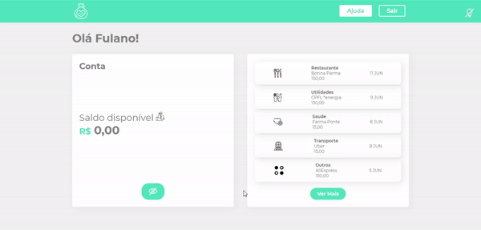

# Smart-Bank

Project created in one of Alura's React courses to learn about how to abstract CSS with Styled Components. <br />

In it I learned how/when: <br />

- To understand class name conflicts with CSS;
- To use Styled Components inside the project;
- To use inheritance within components;
- To use global styles.

# Overview



# How to run

```
# Clone this repository
$ git clone https://github.com/velleeda/Smart-Bank

# Go to the directory
$ cd Smart-Bank
```
  
```
# Install Dependencies
$ npm install

# Run Web Server
$ npm start

# Run Server
$ npm run server
```
